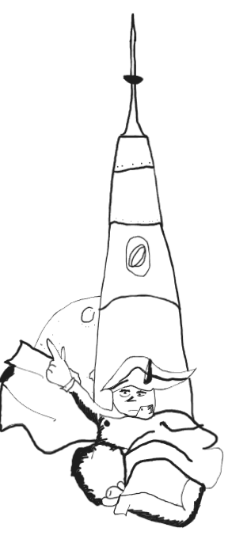
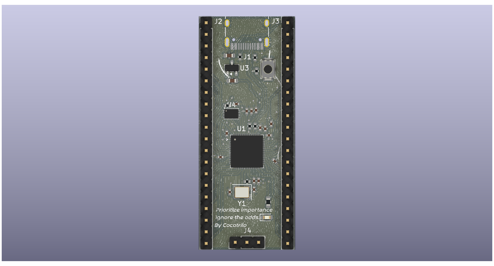
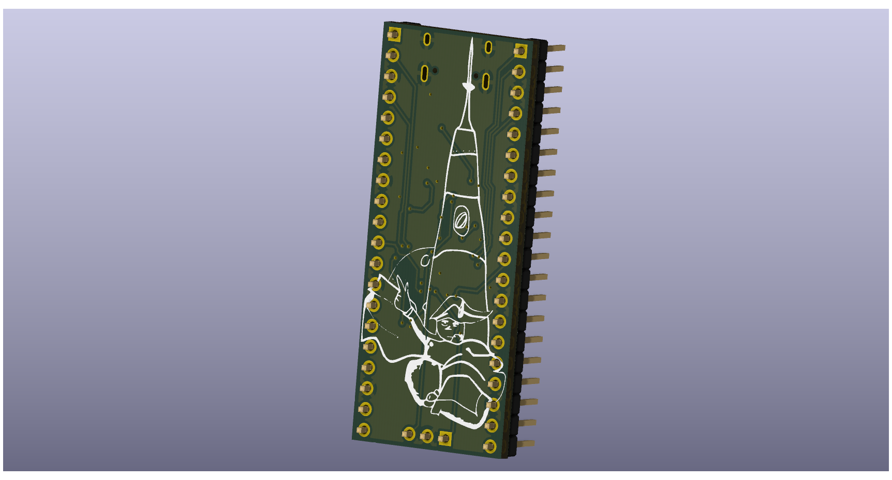

# HALO-0
HALO-0 is a custom development board built around the RP2040 System-on-Chip (SoC).this features a quad memory flash a crystal oscillator, a voltage regulator and a USB C. adding to the repos thematic the HALO-0 has a quote of doubting the impossible and a masterpiece, NAPOLEON TO THE MUNA!

## The reason behind this project
This project started as a following up to the guide provided by *https://github.com/KaiPereira* the ne for making this project possible, basically my goal was to learn the fundamentals, and learn everything about how an actual pcb works, cause I made already two but really basic ones.. so with this project I was able to open more my eyes, and learn a bit more about everything (USB, MEMORY FLASH, CRYSTAL OSCILATORS, VOLTAGE REGULATORS, CAPACITORS, RESISTANCES, ETC). Although I was not finished so I added my OWN style of art, based on my personal preferences (napoleon). and I also added a quote that helped me be disciplined with HackClub Stasis!. its an easter egg hahaha.

## Schematic Overview

this is the schematic 

-

## PCB - DIFERENT VERSIONS

## RENDER!!

## BOM

| Name | Purpose | Qty | Cost (USD) | Distributor
|-----:|----------|----------|-------|-------|
| RP2040 (U1) | Brain of the PCB | 1 | $4.89 | JLCPCB / LCSC |
| W25Q16JVUXIQ | Memory for the PCB | 1 | $5.07 | JLCPCB / LCSC |
| TYPE-C-31-M-12 | USB C Energy & Data | 1 | $0.91 | JLCPCB / LCSC |
| KT-0603R (D1) | LED RED (Cohete Art) | 1 | $0.03 | JLCPCB / LCSC |
|RC0603JR-071KL (R8) | 1k LED resistor | 1 | $0.03 | JLCPCB / LCSC |
| MCP1700T-3302E/TT | Voltage regulator | 1 | $2.43 | JLCPCB / LCSC |
| X322512MSB4SI | Crystal 12Mhz | 1| $0.36 | JLCPCB / LCSC |
| TS-1088-AR02016 | SMD BUTTON | 2 | $0.27 | JLCPCB / LCSC |
| C13-14 10uF | Regulator capacitor | 2 | $0.01 | JLCPCB / LCSC |
| "C1, C10 1uF" | Energy input +1v1 | 2 | $0.01 | JLCPCB / LCSC |
| C2-C9 100nF | Decoupling caps | 8 | $0.01 | JLCPCB / LCSC |

## Final notes!
Thanks for reading! made possible with http://stasis.hackclub.com/
-/
## me
*By cocotrilo*
**made with luv (THIS ONE WAS WITH HATE) jk <3**
